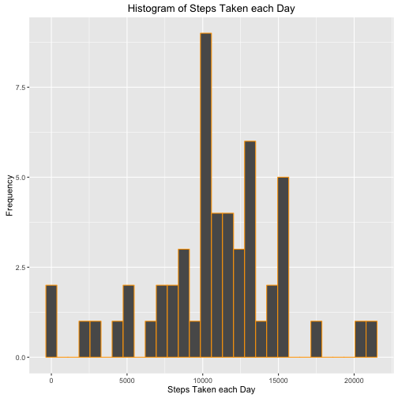
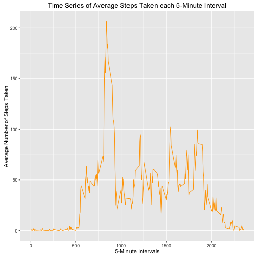
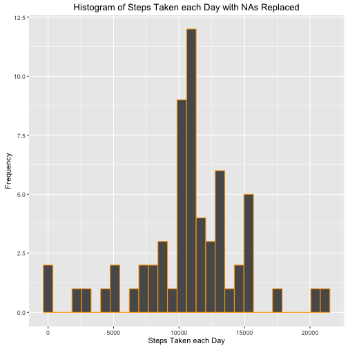
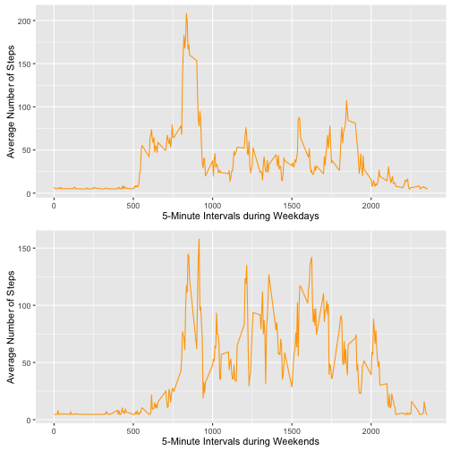

Reproducible Research: Peer Assessment 1
========================================

## Introduction 

This assignment makes use of data from a personal activity monitoring device.
This device collects data at 5 minute intervals through out the day. The data 
consists of two months of data from an anonymous individual collected during the
months of October and November, 2012 and include the number of steps taken in 5
minute intervals each day.

The following report will answer the questions detailed below. Ultimately, the
entire assignment will be in a single R markdown document that can be processed 
by knitr and be transformed into an HTML file.

The questions are:

1. Loading and preprocessing the data.
2. What is mean total number of steps taken per day?
3. What is the average daily activity pattern?
4. Imputing missing values.
5. Are there differences in activity patterns between weekdays and weekends?

## Loading and preprocessing the data

The following code loads the data set and transforms the date column into a date vector.


```r
stepData <- read.csv("activity.csv")
stepData$date <- as.Date(stepData$date, format = "%Y-%m-%d")
head(stepData)
```

```
##   steps       date interval
## 1    NA 2012-10-01        0
## 2    NA 2012-10-01        5
## 3    NA 2012-10-01       10
## 4    NA 2012-10-01       15
## 5    NA 2012-10-01       20
## 6    NA 2012-10-01       25
```

## What is mean total number of steps taken per day?

Firstly, we will make a histogram of the total number of steps taken each day 
using the ggplot2 function.


```r
if(!require(ggplot2)) {
        install.packages("ggplot2")
        library(ggplot2)
}
aggData <- aggregate(steps ~ date, stepData, sum)
ggplot(aggData, aes(steps)) + geom_histogram(colour = "orange") + labs(x = 
"Steps Taken each Day", y = "Frequency",
title = "Histogram of Steps Taken each Day")
```

```
## `stat_bin()` using `bins = 30`. Pick better value with `binwidth`.
```



Now, we will calculate the mean and median total number of steps taken each day.


```r
aggrData <- aggregate(steps ~ date, stepData, sum)
mean(aggrData$steps)
```

```
## [1] 10766.19
```


```r
aggrData1 <- aggregate(steps ~ date, stepData, sum)
median(aggrData$steps)
```

```
## [1] 10765
```

## What is the average daily activity pattern?

We will make a time series plot (i.e. type = "l") of the 5-minute interval
(x-axis) and the average number of steps taken, averaged across all days
(y-axis).


```r
aggData1 <- aggregate(steps ~ interval, stepData, mean)
ggplot(aggData1, aes(interval, steps)) + geom_line(colour = "orange") + labs(x = 
"5-Minute Intervals", y = "Average Number of Steps Taken",
title = "Time Series of Average Steps Taken each 5-Minute Interval")
```



Now, we can work out which 5-minute interval, on average across all the days in
the dataset, contains the maximum number of steps.


```r
aggData <- aggregate(steps ~ interval, stepData, mean)
which.max(aggData[,2])
```

```
## [1] 104
```

```r
aggData[104,]
```

```
##     interval    steps
## 104      835 206.1698
```

## Imputing missing values

Below is a calculation of the total number of missing values in the data set.


```r
sum(is.na(stepData$steps))
```

```
## [1] 2304
```

We will replace all missing values with the overall mean of the number of steps
taken in a single 5-minute interval and we create a new data set.


```r
stepData1 <- stepData
stepData1$steps[which(is.na(stepData$steps))] <- mean(stepData$steps,
                                                      na.rm = T)
```

Below is a histogram of the total number of steps taken each day with the NAs 
now replaced.


```r
aggData2 <- aggregate(steps ~ date, stepData1, sum)
ggplot(aggData2, aes(steps)) + geom_histogram(colour = "orange") + labs(x = 
"Steps Taken each Day", y = "Frequency",
title = "Histogram of Steps Taken each Day with NAs Replaced")
```

```
## `stat_bin()` using `bins = 30`. Pick better value with `binwidth`.
```



Now, we will calculate the mean and median total number of steps taken each day,
with the NAs now replaced.


```r
aggregate(steps ~ date, stepData1, mean)
```

```
##          date      steps
## 1  2012-10-01 37.3825996
## 2  2012-10-02  0.4375000
## 3  2012-10-03 39.4166667
## 4  2012-10-04 42.0694444
## 5  2012-10-05 46.1597222
## 6  2012-10-06 53.5416667
## 7  2012-10-07 38.2465278
## 8  2012-10-08 37.3825996
## 9  2012-10-09 44.4826389
## 10 2012-10-10 34.3750000
## 11 2012-10-11 35.7777778
## 12 2012-10-12 60.3541667
## 13 2012-10-13 43.1458333
## 14 2012-10-14 52.4236111
## 15 2012-10-15 35.2048611
## 16 2012-10-16 52.3750000
## 17 2012-10-17 46.7083333
## 18 2012-10-18 34.9166667
## 19 2012-10-19 41.0729167
## 20 2012-10-20 36.0937500
## 21 2012-10-21 30.6284722
## 22 2012-10-22 46.7361111
## 23 2012-10-23 30.9652778
## 24 2012-10-24 29.0104167
## 25 2012-10-25  8.6527778
## 26 2012-10-26 23.5347222
## 27 2012-10-27 35.1354167
## 28 2012-10-28 39.7847222
## 29 2012-10-29 17.4236111
## 30 2012-10-30 34.0937500
## 31 2012-10-31 53.5208333
## 32 2012-11-01 37.3825996
## 33 2012-11-02 36.8055556
## 34 2012-11-03 36.7048611
## 35 2012-11-04 37.3825996
## 36 2012-11-05 36.2465278
## 37 2012-11-06 28.9375000
## 38 2012-11-07 44.7326389
## 39 2012-11-08 11.1770833
## 40 2012-11-09 37.3825996
## 41 2012-11-10 37.3825996
## 42 2012-11-11 43.7777778
## 43 2012-11-12 37.3784722
## 44 2012-11-13 25.4722222
## 45 2012-11-14 37.3825996
## 46 2012-11-15  0.1423611
## 47 2012-11-16 18.8923611
## 48 2012-11-17 49.7881944
## 49 2012-11-18 52.4652778
## 50 2012-11-19 30.6979167
## 51 2012-11-20 15.5277778
## 52 2012-11-21 44.3993056
## 53 2012-11-22 70.9270833
## 54 2012-11-23 73.5902778
## 55 2012-11-24 50.2708333
## 56 2012-11-25 41.0902778
## 57 2012-11-26 38.7569444
## 58 2012-11-27 47.3819444
## 59 2012-11-28 35.3576389
## 60 2012-11-29 24.4687500
## 61 2012-11-30 37.3825996
```


```r
aggregate(steps ~ date, stepData1, median)
```

```
##          date   steps
## 1  2012-10-01 37.3826
## 2  2012-10-02  0.0000
## 3  2012-10-03  0.0000
## 4  2012-10-04  0.0000
## 5  2012-10-05  0.0000
## 6  2012-10-06  0.0000
## 7  2012-10-07  0.0000
## 8  2012-10-08 37.3826
## 9  2012-10-09  0.0000
## 10 2012-10-10  0.0000
## 11 2012-10-11  0.0000
## 12 2012-10-12  0.0000
## 13 2012-10-13  0.0000
## 14 2012-10-14  0.0000
## 15 2012-10-15  0.0000
## 16 2012-10-16  0.0000
## 17 2012-10-17  0.0000
## 18 2012-10-18  0.0000
## 19 2012-10-19  0.0000
## 20 2012-10-20  0.0000
## 21 2012-10-21  0.0000
## 22 2012-10-22  0.0000
## 23 2012-10-23  0.0000
## 24 2012-10-24  0.0000
## 25 2012-10-25  0.0000
## 26 2012-10-26  0.0000
## 27 2012-10-27  0.0000
## 28 2012-10-28  0.0000
## 29 2012-10-29  0.0000
## 30 2012-10-30  0.0000
## 31 2012-10-31  0.0000
## 32 2012-11-01 37.3826
## 33 2012-11-02  0.0000
## 34 2012-11-03  0.0000
## 35 2012-11-04 37.3826
## 36 2012-11-05  0.0000
## 37 2012-11-06  0.0000
## 38 2012-11-07  0.0000
## 39 2012-11-08  0.0000
## 40 2012-11-09 37.3826
## 41 2012-11-10 37.3826
## 42 2012-11-11  0.0000
## 43 2012-11-12  0.0000
## 44 2012-11-13  0.0000
## 45 2012-11-14 37.3826
## 46 2012-11-15  0.0000
## 47 2012-11-16  0.0000
## 48 2012-11-17  0.0000
## 49 2012-11-18  0.0000
## 50 2012-11-19  0.0000
## 51 2012-11-20  0.0000
## 52 2012-11-21  0.0000
## 53 2012-11-22  0.0000
## 54 2012-11-23  0.0000
## 55 2012-11-24  0.0000
## 56 2012-11-25  0.0000
## 57 2012-11-26  0.0000
## 58 2012-11-27  0.0000
## 59 2012-11-28  0.0000
## 60 2012-11-29  0.0000
## 61 2012-11-30 37.3826
```

Overall, the means do not differ too significantly. The most notable difference
is that the first day of the observations has changed significantly. This is 
because it contained mostly NA values in the original data set.

Furthermore, in the original data set, every day has a median of 0. In the 
updated data set, the median values have jumped to 37.826, which was value that replaced the NAs.

## Are there differences in activity patterns between weekdays and weekends?

The following code creates a new factor variable in the dataset with two levels – “weekday” and “weekend” indicating whether a given date is a weekday or weekend day.


```r
weekdays1 <- c('Monday', 'Tuesday', 'Wednesday', 'Thursday', 'Friday')
stepData1$wDay <- factor((weekdays(stepData1$date) %in% weekdays1), levels=c(FALSE, TRUE), labels=c('weekend', 'weekday'))
head(stepData1)
```

```
##     steps       date interval    wDay
## 1 37.3826 2012-10-01        0 weekday
## 2 37.3826 2012-10-01        5 weekday
## 3 37.3826 2012-10-01       10 weekday
## 4 37.3826 2012-10-01       15 weekday
## 5 37.3826 2012-10-01       20 weekday
## 6 37.3826 2012-10-01       25 weekday
```

Using the new factor variable (wDay), we seperate the data set into total means
at each interval for weekdays and weekends.


```r
aggData3 <- aggregate(steps ~ interval, stepData1[stepData1$wDay == "weekday",], mean)
aggData4 <- aggregate(steps ~ interval, stepData1[stepData1$wDay == "weekend",], mean)
```

Then, using the multiplot function created by Winston Chang - http://stat545.com/block020_multiple-plots-on-a-page.html, we combine the two time series plots created from the two seperated data sets.


```r
p1 <- ggplot(aggData3, aes(interval, steps)) + geom_line(colour = "orange") + labs(x = "5-Minute Intervals during Weekdays", y = "Average Number of Steps")
p2 <- ggplot(aggData4, aes(interval, steps)) + geom_line(colour = "orange") + labs(x = "5-Minute Intervals during Weekends", y = "Average Number of Steps")
multiplot <- function(..., plotlist=NULL, file, cols=1, layout=NULL) {
  require(grid)
  plots <- c(list(...), plotlist)
  numPlots = length(plots)

  # If layout is NULL, then use 'cols' to determine layout
  if (is.null(layout)) {
    # Make the panel
    # ncol: Number of columns of plots
    # nrow: Number of rows needed, calculated from # of cols
    layout <- matrix(seq(1, cols * ceiling(numPlots/cols)),
                    ncol = cols, nrow = ceiling(numPlots/cols))
  }

 if (numPlots==1) {
    print(plots[[1]])

  } else {
    # Set up the page
    grid.newpage()
    pushViewport(viewport(layout = grid.layout(nrow(layout), ncol(layout))))

    # Make each plot, in the correct location
    for (i in 1:numPlots) {
      # Get the i,j matrix positions of the regions that contain this subplot
      matchidx <- as.data.frame(which(layout == i, arr.ind = TRUE))

      print(plots[[i]], vp = viewport(layout.pos.row = matchidx$row,
                                      layout.pos.col = matchidx$col))
    }
  }
}
multiplot(p1, p2)
```


